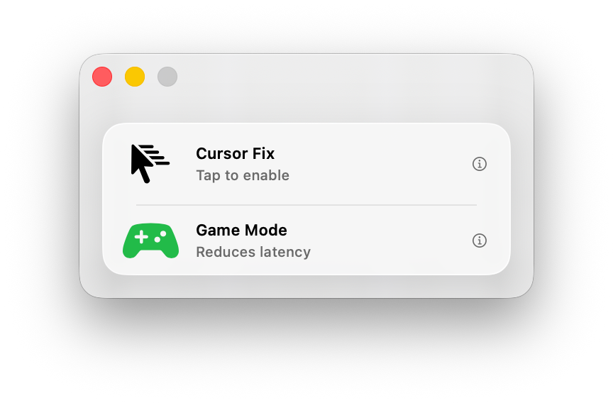

  

<h1 align="center">MacGamingFix</h1>

  Fix the ghost cursor problem in CrossOver/Wine games on macOS.

  

## The Problem

CrossOver and Wine translate Windows games to run on macOS, but they share the macOS system cursor directly as the in-game cursor. During FPS gameplay, the game hides the cursor via `CGDisplayHideCursor`, but an invisible "ghost cursor" continues drifting independently with mouse movement.

When this ghost cursor enters macOS hot zones (Dock, menu bar, hot corners), the WindowServer forces the cursor visible, causing a disruptive system cursor to flash over your game. This is a well-known and long-standing issue with no official fix.

## How MacGamingFix Works

MacGamingFix uses a heuristic-based approach to distinguish between two events that look identical at the API level:

1. **System trigger**: Ghost cursor drifts into a hot zone, macOS forces it visible. We must re-hide immediately.
2. **Game trigger**: The game intentionally calls `ShowCursor` (pause menu, inventory, etc.). We must not interfere.

### The Cursor Fence

The core is a high-frequency polling loop (1000Hz via `DispatchSourceTimer`) that monitors cursor visibility and applies different heuristics per trigger zone:

- **Menu bar**: Click-triggered. Re-hides only when `NSEvent.pressedMouseButtons != 0` (the user clicked into the menu bar area).
- **Dock**: Hover-triggered. Tracks cursor position transitions while hidden. If the cursor *entered* the dock zone while hidden (outside to inside), a system trigger is expected. If the cursor was already there when the game hid it, the next show is from the game.
- **Hot corners**: Hover-triggered with extended detection windows. Uses the same entry-tracking approach as the dock.
- **Screen edges**: General edge detection with motion tracking to catch rapid cursor movements into trigger zones.

When a system trigger is detected, the fence re-hides the cursor. When the game shows the cursor intentionally, the fence releases all accumulated hides and hands control back.

### Private APIs

MacGamingFix uses several private/undocumented macOS APIs loaded at runtime via `dlsym`:

| API | Framework | Purpose |
|-----|-----------|---------|
| `SLCursorIsVisible()` | SkyLight | Query cursor visibility state (replaces deprecated `CGCursorIsVisible`) |
| `SLDisplayHideCursor(displayID)` | SkyLight | Hide the cursor on a display (replaces deprecated `CGDisplayHideCursor`) |
| `SLDisplayShowCursor(displayID)` | SkyLight | Show the cursor on a display (replaces deprecated `CGDisplayShowCursor`) |
| `CGSMainConnectionID()` | CoreGraphics | Get the main connection ID for WindowServer communication |
| `CGSSetConnectionProperty(cid, cid, key, value)` | CoreGraphics | Set the `SetsCursorInBackground` property, allowing cursor hide/show to work even when our app is not frontmost |

The `SetsCursorInBackground` connection property is critical. Without it, `SLDisplayHideCursor` only works when our app is the active application, which is never the case during gameplay.

### Hide/Show Counter

`CGDisplayHideCursor` and `SLDisplayHideCursor` use a **counter**, not a boolean. Each hide call decrements the counter, each show call increments it. The cursor is only visible when the counter is >= 0. This means:

- Calling hide N times requires N matching show calls to make the cursor visible again
- The fence tracks `ourHideCount` to know exactly how many hides to undo
- When releasing control back to the game, `releaseHides()` calls show exactly `ourHideCount` times

### Game Detection

The app automatically detects which game is running. When the cursor first becomes hidden (indicating a game has captured it), the fence captures the frontmost application as the tracked game. If you switch to a different app, the fence forces the cursor visible so you can interact normally.

### Game Mode

MacGamingFix can optionally enable macOS Game Mode via `gamepolicyctl`, which reduces Bluetooth audio/input latency and prioritizes CPU/GPU scheduling for your game. This requires Xcode Command Line Tools to be installed.

## Requirements

- macOS 26 or later
- CrossOver or Wine game
- Optional: Xcode Command Line Tools (for Game Mode)

## Installation

1. Download the latest `.zip` from the [Releases](../../releases/latest) page.
2. Unzip and drag **MacGamingFix.app** to your Applications folder.
3. On first launch, macOS will block the app because it is not notarized (see [why](#why-unsigned) below). To allow it:
   - Try to open the app — macOS will show a warning and prevent it from launching.
   - Go to **System Settings → Privacy & Security**, scroll down, and click **Open Anyway** next to the MacGamingFix message.
   - You only need to do this once — subsequent launches will work normally.

### Why unsigned?

MacGamingFix relies on private macOS APIs (`SkyLight`, `CoreGraphics`) loaded at runtime via `dlsym`. Apple's notarization process requires Hardened Runtime and App Sandbox, both of which block the private API access this app needs to function. Signing without notarization would still trigger Gatekeeper warnings, so distributing unsigned is the pragmatic choice for this type of utility.

The app is fully open source — you can always audit the code and [build from source](#build-from-source) if you prefer.

## Usage

1. Launch MacGamingFix.
2. Tap **Cursor Fix** to activate.
3. Switch to your game and play.
4. Tap **Cursor Fix** again to deactivate when done.

## Build from Source

If you'd rather build it yourself:

1. Clone the repository.
2. Open `MacGamingFix.xcodeproj` in Xcode.
3. Build and run (Cmd+R).

## Limitations

- Uses private macOS APIs that may change between OS versions.
- The heuristic approach is not perfect. Edge cases exist where the cursor may briefly appear or fail to appear in rare situations.
- App Sandbox is disabled (required for `dlsym` access to private frameworks and `gamepolicyctl`).

## Contributing

See [CONTRIBUTING.md](CONTRIBUTING.md).

## License

See [LICENSE](LICENSE).
